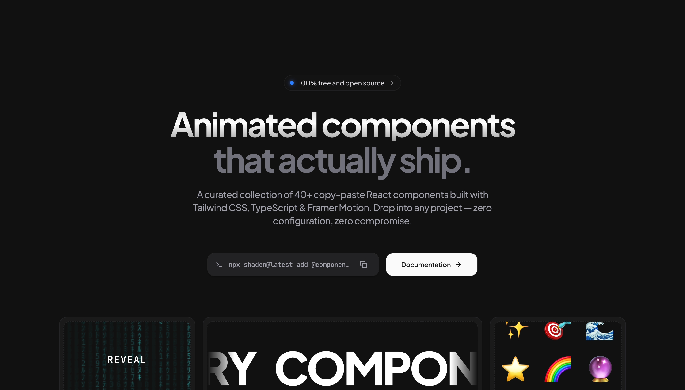

<div align="center">
  
</div>

<h1 align="center">Spider UI</h1>

<p align="center">
  <strong>Beautiful, interactive UI components you can copy and paste into your apps.</strong>
</p>

<p align="center">
  Crafted with React, Tailwind CSS, and Framer Motion. Open source. Free forever.
</p>

<p align="center">
  <a href="https://spiderui.dev">Documentation</a> ·
  <a href="https://spiderui.dev/docs/components">Components</a> ·
  <a href="https://github.com/ctrlcat0x/spiderui/issues">Report Bug</a> ·
  <a href="https://github.com/ctrlcat0x/spiderui/issues">Request Feature</a>
</p>

<p align="center">
  <a href="https://github.com/ctrlcat0x/spiderui/blob/main/LICENSE">
    
  </a>
  <a href="https://twitter.com/ctrlcat0x">
    
  </a>
</p>

---

## Introduction

Spider UI is a collection of beautifully designed, interactive UI components built with React and Tailwind CSS. Just run the CLI command, add the component to your project, and start building.

### Why Spider UI?

- **Copy & Paste** - Not a dependency. You own the code.
- **Interactive** - Cursor-following effects, 3D transforms, and smooth animations.
- **Customizable** - Built with Tailwind CSS. Easy to modify.
- **Accessible** - WAI-ARIA compliant components.
- **Dark Mode** - All components support light and dark modes.
- **TypeScript** - Fully typed for the best developer experience.


## Quick Start

### Installation via CLI

The fastest way to add components is using the shadcn CLI:

```bash
npx shadcn@latest add @spiderui/spotlight-card
```


## Development

This project uses [Turborepo](https://turbo.build/repo) for monorepo management.

### Prerequisites

- Node.js 20+
- pnpm 10+

### Setup

```bash
# Clone the repository
git clone https://github.com/ctrlcat0x/spiderui.git
cd spiderui

# Install dependencies
pnpm install

# Start development server
pnpm dev
```

### Project Structure

```
spiderui/
├── apps/
│   └── web/                 # Documentation site (Next.js)
├── packages/
│   ├── ui/                  # Component library
│   ├── eslint-config/       # Shared ESLint configuration
│   └── typescript-config/   # Shared TypeScript configuration
└── turbo.json               # Turborepo configuration
```

### Available Scripts

| Command | Description |
|---------|-------------|
| `pnpm dev` | Start development server |
| `pnpm build` | Build all packages |
| `pnpm lint` | Run linting |
| `pnpm format` | Format code with Prettier |

## Contributing

We welcome contributions! Whether it's:

- Reporting a bug
- Submitting a fix
- Proposing new features
- Creating new components

### How to Contribute

1. Fork the repository
2. Create your feature branch (`git checkout -b feature/amazing-component`)
3. Commit your changes (`git commit -m 'Add amazing component'`)
4. Push to the branch (`git push origin feature/amazing-component`)
5. Open a Pull Request

### Component Guidelines

When creating new components:

- Use TypeScript with proper type definitions
- Support both light and dark modes
- Include comprehensive props with sensible defaults
- Add smooth transitions and animations
- Write clear documentation with examples
- Follow existing code style and patterns

## Tech Stack

- **Framework**: [Next.js 16](https://nextjs.org/)
- **Styling**: [Tailwind CSS 4](https://tailwindcss.com/)
- **Components**: [React 19](https://react.dev/)
- **Build**: [Turborepo](https://turbo.build/repo)
- **Package Manager**: [pnpm](https://pnpm.io/)

## License

MIT License - feel free to use these components in personal and commercial projects.

## Third-Party Licenses

Some components use third-party dependencies with separate license terms.

- `image-trail` and `layered-stack` require `gsap` (GSAP).
- If you use or redistribute those components, you are responsible for complying with GSAP's license terms.
- GSAP license: https://gsap.com/licensing/

See [LICENSE](./LICENSE) for more information.

## Acknowledgments

- Inspired by [shadcn/ui](https://ui.shadcn.com/)
- Built with [Tailwind CSS](https://tailwindcss.com/)
- Powered by [Vercel](https://vercel.com/)

---

<p align="center">
  Made with care by <a href="https://twitter.com/ctrlcat0x">ctrlcat0X</a>
</p>
